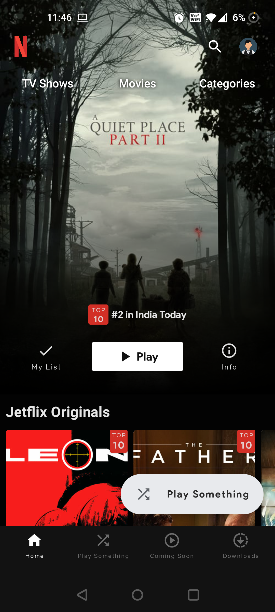
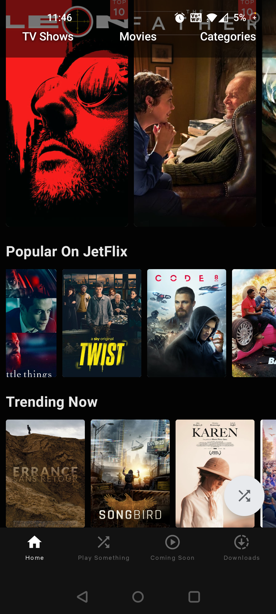
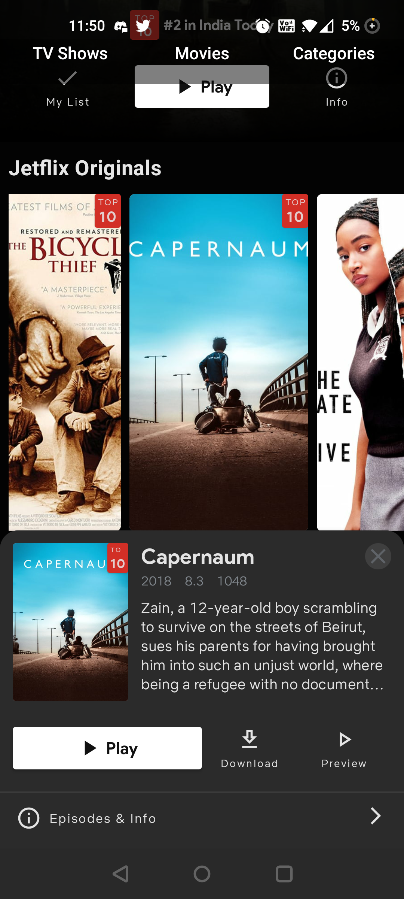
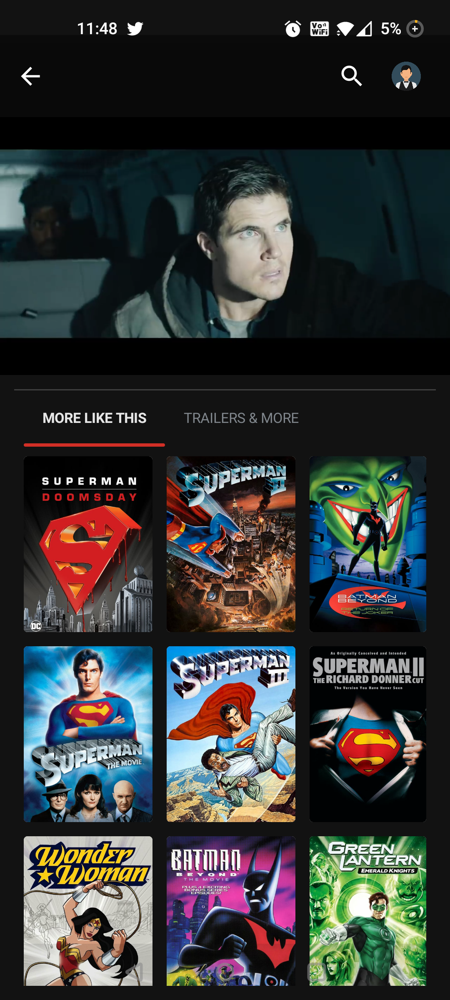

# JetFlix

A clone of Android NetFlix app in Android built using Jetpack compose.

<div align="left">
    <a href = "https://developer.android.com/jetpack/androidx/versions/all-channel#may_5_2021">
        
    </a>
</div>
<br>
<div align="left">
    <a href = "https://github.com/pushpalroy/jetflix/network/">
        
    </a>
    <a href = "https://github.com/pushpalroy/jetflix/stargazers">
        
    </a>
    <a href = "https://github.com/pushpalroy/jetflix/issues">
        
    </a>  
    <a href = "https://ggithub.com/pushpalroy/jetflix/blob/master/LICENSE">
        
    </a>
    <a href="">
        
    </a>
    <a href = "https://twitter.com/pushpalroy">
        
    </a>
</div>

### This sample app showcases the following:

* MVVM Architecture (ViewModel + MutableState + LiveData)
* Dagger Hilt for DI
* ExoPlayer for playing videos
* Compose BottomSheetScaffold
* Compose ConstraintLayout
* Compose TopBar and FAB animations
* Using TMDb API as a data source

### Screens
Demo             |  Home | Home Sections
:-------------------------:|:-------------------------: | :-------------------------: 
  |   | 

Movie Summary             |  Movie Details | More Like This
:-------------------------:|:-------------------------: | :-------------------------: 
  |   | 

### Status: 🚧 In progress
<p>JetFlix is still under development and more screens will be added.</p>

### Libraries used

* [Jetpack Compose]
* [Accompanist]
* [Coroutines]
* [Exoplayer]
* [Lottie Compose]
* [Compose Navigation]

[Jetpack Compose]: https://developer.android.com/jetpack/compose
[Accompanist]: https://github.com/chrisbanes/accompanist
[Coroutines]: https://developer.android.com/kotlin/coroutines
[ExoPlayer]: https://github.com/google/ExoPlayer
[Lottie Compose]: https://github.com/airbnb/lottie
[Compose Navigation]: https://developer.android.com/jetpack/compose/navigation

### How to get started
Please get Android Studio Arctic Fox 2020.3.1 Beta 3 or above to build this project
from [from here](https://developer.android.com/studio/preview/).

Generate API key from [The Movie Database API](https://developers.themoviedb.org/3), place the key in 'local.properties' file as apiKey="<YOUR_API_KEY_HERE">.

### License
```
Copyright 2020 Pushpal Roy

Licensed under the Apache License, Version 2.0 (the "License");
you may not use this file except in compliance with the License.
You may obtain a copy of the License at

    http://www.apache.org/licenses/LICENSE-2.0

Unless required by applicable law or agreed to in writing, software
distributed under the License is distributed on an "AS IS" BASIS,
WITHOUT WARRANTIES OR CONDITIONS OF ANY KIND, either express or implied.
See the License for the specific language governing permissions and
limitations under the License.
```
